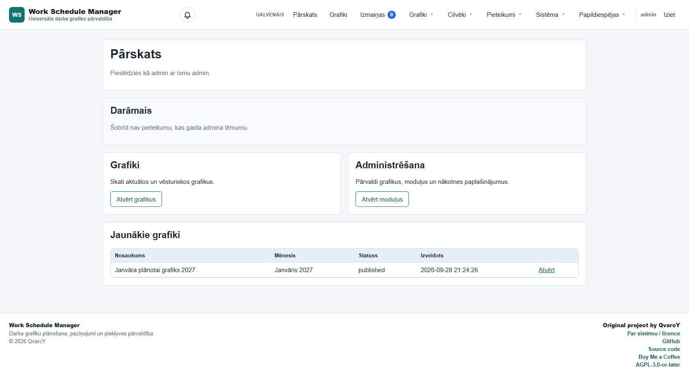
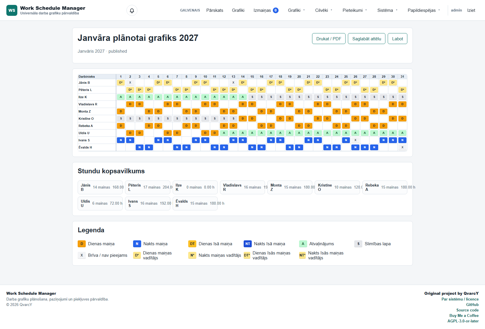

# Work Schedule Manager

[](LICENSE)
[](https://www.php.net/)
[](https://mariadb.org/)

A self-hosted work schedule management application for creating,
publishing and managing employee shift schedules.

**Original project by [QvarcY](https://github.com/QvarcY).**

[Source code](https://github.com/QvarcY/work-schedule-manager)
Ā·
[Buy Me a Coffee](https://buymeacoffee.com/craftin)
Ā·
[License](LICENSE)

---

## Overview

Work Schedule Manager is a lightweight PHP application for teams that
need a practical way to create and maintain shift schedules without
depending on a hosted SaaS platform.

The project includes schedule creation, shift types, employee profiles,
role-based permissions, notifications, change tracking, acknowledgements,
day-off requests and invitation-based user onboarding.

The application is designed to be self-hosted on a standard PHP and
MySQL/MariaDB environment.

The current user interface is primarily in Latvian.

## Screenshots

### Dashboard



### Published schedule



The screenshots above use local demonstration data.

## Features

- Create, edit, publish and archive work schedules
- Configurable day, night and custom shift types
- Employee accounts and employee profiles
- Role and permission system
- Per-user schedule visibility modes
- Schedule change history
- Schedule acknowledgement tracking
- Day-off requests
- Internal notifications
- Optional email notifications
- Invitation-based account creation
- Activity logging
- Modular extension system
- Responsive web interface
- CLI installer for fresh deployments
- Migration validation tooling
- No framework or Composer dependency required for the core application

## Bundled modules

| Module | Purpose |
| --- | --- |
| EmployeeProfiles | Employee profiles and schedule visibility settings |
| Notifications | Internal user notifications |
| EmailNotifications | Email notification delivery |
| DayOffRequests | Employee day-off requests |
| ScheduleAcknowledgements | Schedule acknowledgement tracking |
| ScheduleChangeLog | Detailed schedule change history |
| SystemStatus | System and environment status information |
| UserInvitations | Controlled invitation-based user onboarding |

## Requirements

- PHP 8.1 or newer
- PDO
- `pdo_mysql`
- `mbstring`
- MySQL or MariaDB
- A web server whose document root can point to `public/`

The PHP `zip` extension is optional, but required for ZIP-based module
upload functionality.

The project has been fresh-install tested with PHP 8.2 and MariaDB 11.4.

## Quick start

Clone the repository:

```bash
git clone https://github.com/QvarcY/work-schedule-manager.git
cd work-schedule-manager
```

Create the local environment file:

```bash
cp .env.example .env
```

On Windows PowerShell:

```powershell
Copy-Item .env.example .env
```

Create an empty MySQL or MariaDB database and a dedicated database user,
then configure the connection in `.env`.

Run the installer preflight check:

```bash
php tools/install.php --check
```

Install the application:

```bash
php tools/install.php
```

The installer will:

1. validate the PHP environment;
2. verify migration files and module manifests;
3. install the core database schema;
4. initialize roles and permissions;
5. install the bundled modules;
6. create the first administrator account;
7. generate a secure administrator password.

Save the generated administrator password when it is displayed.

## Development server

For local development, PHP's built-in server can be used:

```bash
php -S 127.0.0.1:8080 -t public tools/dev-router.php
```

Then open:

```text
http://127.0.0.1:8080
```

The built-in PHP server is intended for development only.

## Production deployment

Point the web server document root to:

```text
/path/to/work-schedule-manager/public
```

Do not expose the project root itself as the public web directory.

Before production use:

- configure the final HTTPS `APP_URL`;
- keep `APP_DEBUG=false`;
- keep `.env` outside version control;
- use a dedicated database account;
- verify HTTPS before signing in;
- configure mail settings only if email notifications are required.

## Configuration

Application configuration is stored in `.env`.

The repository contains `.env.example` with safe example values.

Never commit `.env`.

## Database migrations

Core migrations live in:

```text
database/migrations/
```

Module migrations live inside the corresponding module:

```text
modules/<ModuleName>/migrations/
```

Migration syntax can be validated without touching a database:

```bash
php tools/check-migrations.php
```

## Project structure

```text
app/          Core application code
database/     Core database migrations and seed data
modules/      Bundled application modules
public/       Web document root and public assets
storage/      Runtime/generated data
tests/        Test-related files
tools/        CLI installer and development utilities
```

## Security

Security-related information and reporting guidance can be found in
[SECURITY.md](SECURITY.md).

Please do not publish exploitable security vulnerabilities in a public
GitHub issue.

## Contributing

Contributions are welcome.

Before submitting changes, please read
[CONTRIBUTING.md](CONTRIBUTING.md).

## License and attribution

Copyright (C) 2026 QvarcY.

Work Schedule Manager is distributed under the
**GNU Affero General Public License v3.0 or later**.

See:

- [LICENSE](LICENSE)
- [NOTICE.md](NOTICE.md)
- [ADDITIONAL_TERMS.md](ADDITIONAL_TERMS.md)

The additional terms contain attribution, origin and branding provisions
permitted under GNU AGPL v3 section 7.

Modified versions must not misrepresent themselves as an official or
unmodified release published by QvarcY.

## Author

**QvarcY**

GitHub:
https://github.com/QvarcY

Original repository:
https://github.com/QvarcY/work-schedule-manager

If this project is useful to you, you can support its continued
development:

**Buy Me a Coffee:**

https://buymeacoffee.com/craftin

---

Built and maintained by **QvarcY**.
